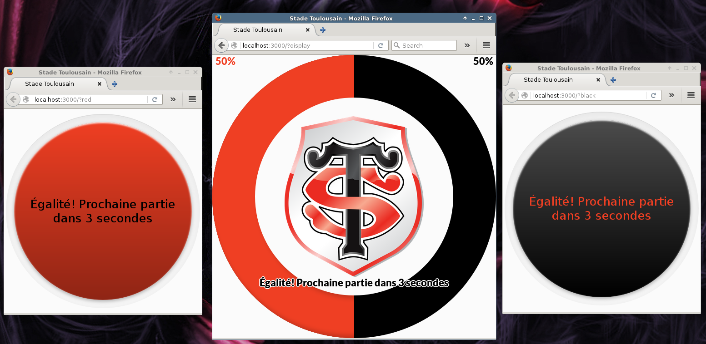

# StadeToulousain-Tap
Little game to be played during half time

# Presentation

This game is intended to be played in the [**Stade Toulousain**](http://www.stadetoulousain.fr/) during the half time.

Each supporter can pick a team (either red or black) and has to **tap** has much as he can the button for the duration of the game.

The number of **taps** of every supporters in each team is accumulated for the duration of the game (20 seconds) and shown in **real time** on the big screens.

The server automatically start a **20 seconds** game, with a pause of **5 seconds**.

# How to use

To host a game, you need to have [Node.js](https://nodejs.org/) and the depencies:
- socket.io
- express

Exact versions of these dependencies can be found in [package.json](package.json)

Using the command `node index` will open a server, with the first printed lines being the **ip** and the **port** the supporters will have to use

Once the server is running, users simply have to go to `ip:port/?red` or `ip:port/?black` to chose a team, or `ip:port/?display`, as seen in the picture above, to see the current progress of the game. (Obvisouly, ip and port have to be replaced by the ip and port printed at the launch of the server).
